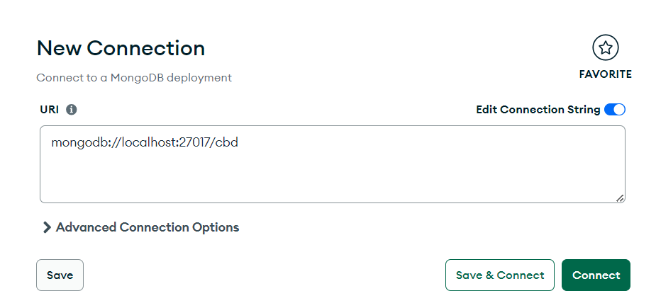

# Manual de despliegue

En este punto vamos a explicar paso a paso lo que ha de realizar el usuario para poder desplegar e instanciar el proyecto en local.

## Herramientas necesarias

Primero de nada, vamos a comentar las herramientas que son necesarias para el usuario para poder desplegar y probar el proyecto en local.

| Herramienta | Motivación                                                                           | Enlace de descarga                                                  |
| ----------- | ------------------------------------------------------------------------------------ | ------------------------------------------------------------------- |
| Git         | Git es sumamente importante debido a la necesidad de clonar el proyecto para su uso. | [Descarga de Git](https://git-scm.com/downloads)                    |
| Mongo       | Base de datos a usar, totalmente imprescindible.                                     | [Descarga de Mongo](https://www.mongodb.com/try/download/community) |
| Postman     | No imprescindible pero sí ALTAMENTE recomendada.                                     | [Descarga de Postman](https://www.postman.com/downloads/)           |
| pnpm        | Necesario para la instalación de todos los paquetes.                                 | [Explicación](https://pnpm.io/es/installation)                      |

**Explicación:**

- A la hora de instalar mongo, cuando nos pregunten si deseamos instalar Mongo Compass, hemos de marcar que Sí.

## Instanciar el proyecto

En este punto vamos a dar por hecho que ya se tienen instaladas todas las herramientas previamente instaladas. Pasemos a instanciar el proyecto.

Lo primero que debemos de realizar es clonar el proyecto. Para esto ejecutaremos el siguiente comando en nuestra terminal favorita, previamente habiéndonos situado en la carpeta donde queremos clonar el proyecto.

```bash
git clone https://github.com/jmartinacu/Node-CBD.git
```

Tras esto nos situaremos en la carpeta src del proyecto que acabamos de clonar, tras lo que ejecutaremos el siguiente comando para instalar las dependencias necesarias.

```bash
pnpm install
```

Una vez realizado esto, debemos de crear un archivo .env (hemos creado el archivo .env.example con todas las variables de configuración necesarias para el despliegue).

A continuación hay que definir las siguientes variables:

- CONN_STRING: Valor booleano opcional, donde si se especifica true significara que se use la variable de entorno de DB_URI para conectar la aplicación a MongoDB, por defecto se establece como false y se usa la conexión por defecto de mongo.
- DB_URI: Variable de entorno opcional que si se ha establecida la variable anterior a true se usará solamente el valor de esta variable para conectar la aplicación con MongoDB.
- DB_NAME: Variable de entorno que tiene el nombre de la base de datos que se usará en MongoDB.
- DB_USER: Variable de entorno que tienen el nombre del usuario que se usará en MongoDB.
- DB_PASS: Variable de entorno que tiene la contraseña del usuario que se usará en MongoDB.

Para las siguientes cuatro variables hay que generar dos claves RSA de 4096 bits que se usarán para firmar los tokens de access y refresh de la aplicación para su generación recomendamos la página [siguiente](https://cryptotools.net/rsagen) generar RSA.

Tras la creación de este archivo, hemos de ejecutar el siguiente comando para que empiece a correr el proyecto:

```bash
pnpm run dev
```

Tras esto, pasaremos a configurar la base de datos. Para esto, abriremos la aplicación MongoDB Compass previamente instalada. Una vez abierta, le daremos al botón de “New connections” situado arriba a la izquierda. Tras esto deberemos de rellenar la pantalla que nos sale con los siguientes datos.

[Figura 8: Datos Mongo Compass]

Daremos click en “Save & Connect”, llamando a la conexión “CBD”. Una vez realizado esto, Mongo se encargará de crear tanto la BD como las colecciones.

Por último, hemos de abrir PostMan, crearnos un Workspace e importar los siguientes archivos, uno en las colecciones y otro en las variables de entorno.
Estos archivos se encuentran en el proyecto, en la carpeta “static/files”
Estos archivos se encuentran en el proyecto, en la carpeta “static/files”

Tras esto, ya lo tendremos todo configurado para poder empezar a probar el proyecto.

Lo único que hay que tener en cuenta en este caso se trata de la variable de entorno de Postman llamada “host.”

[Figura 9: Variable Host]

Dependiendo de si queremos probar el proyecto en local o en remoto, hemos de cambiar esta.

- Local: http://localhost:3000
  Esta URL la podremos encontrar en la consola al ejecutar el proyecto, aunque normalmente suele ser la mencionada anteriormente.
- Remoto: https://node-cbd.onrender.com
  Esta se trata de la url del proyecto desplegado.

En caso de usar el proyecto en remoto, únicamente será necesario realizar los pasos de PostMan.

# Manual de Usuario

Una vez tengamos desplegado e instanciado el proyecto, podemos pasar a realizar diversas funciones con este. A continuación, vamos a ver una serie de distintos endpoints con los que podemos realizar distintas funcionalidades. Comentar que los endpoints marcados en rojo se han creado mediante el uso de Aggregations Pipelines.

## User

- **Register User**: Endpoint que se encarga de registrar a nuevos usuarios, recibiendo un JSON en el body de la petición con los siguientes campos: firstName, lastName, email, password y passwordConfirmation.
- **Verify User**: Endpoint que se encarga de verificar el email de un usuario, recibiendo por parámetros de la petición el id del usuario a verificar y un código que se manda al email proporcionado por el usuario al registrarse.
- **Request reset password**: Endpoint que se encarga de mandar un código para cambiar la contraseña de un usuario, recibiendo un JSON en el body de la petición que tiene un campo de email.
- **Reset password**: Endpoint que recibe por parámetro de la petición el código generado por la petición anterior y el id del usuario que va a cambiar de contraseña, junto a un JSON en el body de la petición con los siguientes campos: email, password, passwordConfirmation.
- **Me**: Endpoint que recibe una cabecera de autentificación “Authorization” (un Bearer Token) el valor del token tienen que ser el accessToken proporcionado por la petición login de la aplicación. Devuelve un JSON con información sobre el usuario que ha iniciado sesión, específicamente los siguientes campos: \_id, email, firstName, lastName, createdAt, updatedAt.
- **Top 3**: Endpoint que se encarga de devolver un JSON con todos los datos de los 3 usuarios a los que más dinero les deben de toda la base de datos.
- **Negative people**: Endpoint que devuelve un JSON con el nombre, apellido y dinero total de todos los usuarios que deben dinero.
- **Positive people**: Endpoint que devuelve un JSON con el nombre, apellido y dinero total de todos los usuarios a los que les deben dinero.
- **Average costs**: Endpoint que devuelve una media de los gastos de todos los usuarios que han realizado pagos divididos estos por los pagos que ha realizado en cada grupo. Ej: Si un usuario ha realizado pagos en 2 grupos, este usuario será devuelto 2 veces, en cada una de estas se indica el grupo al que pertenece la media calculada y el dinero total gastado.

## Auth

- **Login**: Endpoint que recibe un JSON en el body de la petición con los siguientes campos: email y password. Que devuelve un JSON con dos campos, accessToken y refreshToken, con los tokens de autenticación que serán usables durante la sesión del usuario. El accessToken tiene un tiempo de vida de 15 minutos y el refreshToken de 1 año.
- **Refresh access token**: Endpoint que recibe una cabecera “x-refresh” con el valor del refreshToken proporcionado en la petición anterior, que refresca la sesión del usuario si el accessToken había caducado y devuelve un JSON con el campo de accessToken.

## Group

- **Create Group**: Endpoint que se encarga de crear un grupo en la aplicación recibe un JSON en el body de la petición con dos campos, name y users. Name tiene que ser el nombre del nuevo grupo y users una lista que contenga los ids de los usuarios que pertenecen a este nuevo grupo.
- **Get Groups**: Endpoint que devuelve una lista de todos los grupos almacenados en la aplicación, cada grupo tiene los siguientes campos: \_id, name, users, transactionsAmount, createdAt y updatedAt.
- **Get Group**: Endpoint que devuelve la información de un solo grupo, donde se manda la id de este grupo por los parámetros de la petición. La información del grupo tiene los mismos campos que los definidos en la petición anterior.
- **Update Group**: Endpoint que modifica los campos del grupo cuya id es pasada por los parámetros de la petición y necesita tener dos cabeceras de autenticación y autorización, una cabecera Authorization con la información del accessToken del usuario en formato “Bearer Token” y una cabecera Group con la id del grupo a modificar, para verificar que el usuario que solicita la petición es parte del grupo, el body de la petición tiene un JSON que puede tener los campos name o users. Reemplazando la información anterior del grupo por los nuevos valores enviados.
- **Get User’s Groups**: Endpoint que devuelve una lista con los grupos del usuario autentificado mediante la cabecera Authorization con el accessToken.
- **Delete Group**: Endpoint que elimina el grupo cuya id se pasa por parámetros de la petición, necesitando las dos cabeceras Authorization y Group explicadas anteriormente.
- **Payments per group**: Endpoint que se encarga de generar todos pagos de los grupos a los que pertenece el usuario que realiza la petición.
- **Add User to Group**: Endpoint que añade usuarios a un grupo, que recibe un JSON en el body de la petición con un campo users, es una lista con las ids de los usuarios a agregar al grupo, también se deben agregar las cabeceras Authorization y Group.

## Payment

- **Do payment**: Endpoint que crea un pago en la aplicación, recibe un JSON en el body de la petición con dos campos receiver y amount, id del usuario al que se paga y cantidad que se paga, también hay que agregar las cabeceras Authorization y Group explicadas anteriormente. Los dos usuarios de la transacción tienen que estar en el mismo grupo que se indica en la cabecera Group.
- **Cancel Payment**: Endpoint que elimina el pago cuya id se pasa por los parámetros de la petición, añadiendo las cabeceras Authorization y Group para verificar que eres parte del grupo donde se hizo el pago.
- **Get Payments**: Endpoint que devuelve todos los pagos realizados en la aplicación, con una lista donde cada elemento tiene los siguientes campos: \_id, group, payer, receiver, amont, createdAt, updatedAt. También hay que enviar el token Authorization para autentificar al usuario.
- **Get User Payments**: Endpoint que devuelve todos los pagos realizados por el usuario autentificado, en una lista donde cada elemento es igual a los definidos en la petición anterior. Para autentificar al usuario hay que enviar la cabecera Authorization con el accessToken.

En caso de error 403, ejecutar el endpoint “Refresh Access Token”, ya que este caduca a los 15 min.
